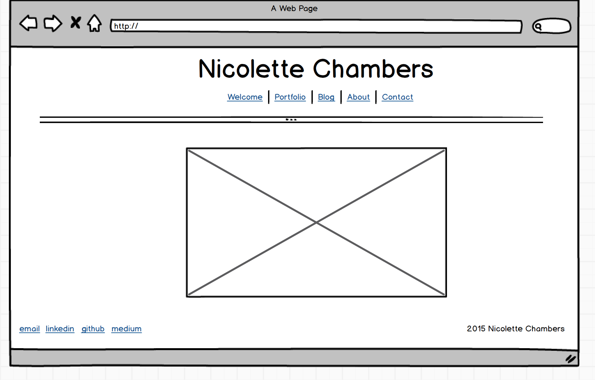

**Index.html wireframe**

**Blog\Index.html**

**What is a wireframe?**

Wireframing is the architectural blueprint of how information on a website will be organized. It's primary focus is the layout, and less on aesthetics such a color and font.

**What are the benefits of wireframing?**

Wireframing forces a person to think about:
1. What information is someone trying to get from this site?
2. What it the best way to organize this information on the site ?
3. Creates a shared understanding across the team (devs,qas, etc.) about the layout of the website

**Did you enjoy wireframing your site?**

I did enjoy wireframing my site. I didn't think I would. I really can't draw, so I found using a wireframing tool helpful. Once I got the hang of the tool it was a super quick process.

**Did you revise your wireframe or stick with your first idea?

I stuck with my first idea. I was pretty clear before I started wireframing how I wanted my site to look.

**What questions did you ask during this challenge? What resources did you find to help you answer them?**

I felt reading the two articles did a good job of clarifying what a UX person does. I've worked with UX people before in limited capacities, but I still wasn't clear what they did besides create wireframes. So it was nice reading about the process that must occur before they can actually create a layout for a particular feature.

**Which parts of the challenge did you enjoy and which parts did you find tedious?**

I didn't really find this challenge to be tedious. I thought it was short and too the point.
