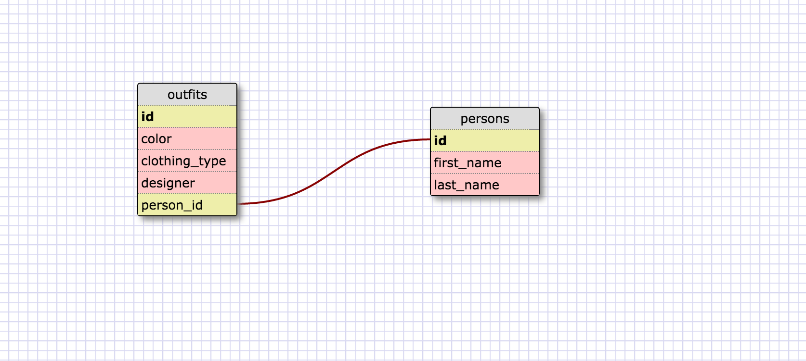

1. Select all data for all states.
```
SELECT * FROM states;
```

2. Select all data for all regions.
```
SELECT * FROM regions;
```

3. Select the state_name and population for all states.
```
SELECT state_name, population FROM states;
```

4. Select the state_name and population for all states ordered by population. The state with the highest population should be at the top.
```
SELECT state_name, population FROM states ORDER BY population DESC;
```

5. Select the state_name for the states in region 7.
```
SELECT state_name FROM states WHERE region_id = 7;
```

6. Select the state_name and population_density for states with a population density over 50 ordered from least to most dense.
```
SELECT state_name, population_density FROM states WHERE population_density > 50 ORDER BY population_density;
```

7. Select the state_name for states with a population between 1 million and 1.5 million people.
```
SELECT state_name FROM states WHERE population BETWEEN 1000000 AND 1500000;
```

8. Select the state_name and region_id for states ordered by region in ascending order.
```
SELECT state_name, region_id FROM states ORDER BY region_id;
```

9. Select the region_name for the regions with "Central" in the name.
```
SELECT region_name FROM regions WHERE region_name LIKE '%Central%';
```

10. Select the region_name and the state_name for all states and regions in ascending order by region_id.
```
SELECT Regions.region_name, States.state_name FROM STATES INNER JOIN Regions ON States.region_id=Regions.id ORDER BY region_id;
```
#Schema Design for closet database


#Reflection:
**What are databases for?**
Databases are used to store data. You can then access, alter or delete that data via a special language called SQL.

**What is a one-to-many relationship?**
It models the relationship of one piece of information from one table having many of another piece of data from a different table.

**What is a primary key? What is a foreign key? How can you determine which is which?**
A primary key is a unique identifier in a table. While a foreign key maps to the the primary key in another table. It's used to create associations between tables.

**How can you select information out of a SQL database? What are some general guidelines for that?**
If you want to select information out of a SQL database you have to use the keyword select. If you want to select all the information from each column in a database you can use the wildcard operator(*) to select all the column names. If you want to select just certain columns you just write out each column name and seperate each column name with a comma. If you join two tables together then you need to specify the table name followed by a dot then the column name.